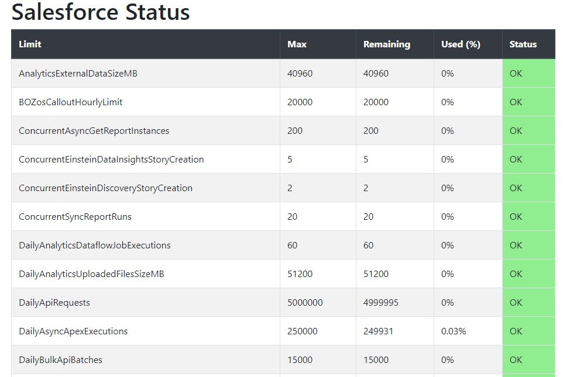

# Salesforce Limit Status (node-jsforce)

A very simple Salesforce - Node.js Limit Status Page using [Express](http://expressjs.com/).



## Add your env parameters
Make sure you create a .env file in the root folder with the following information

```env
NODE_ENV=development
PORT=5000
SF_LOGIN_URL=https://test.salesforce.com or https://login.salesforce.com (for production) 
SF_USERNAME=xxx@xxx.com
SF_PASSWORD=xxxxx
SF_SECURITY_TOKEN=xxxxxxxxxxxxx
```

## Running Locally

Make sure you have [Node.js](http://nodejs.org/) and the [Heroku CLI](https://cli.heroku.com/) installed.

```sh
$ git clone git@github.com:carlosdevia/salesforcelimits.git # or clone your own fork
$ npm install
$ npm start
```

Your app should now be running on [localhost:5000](http://localhost:5000/).

## Deploying to Heroku

```
$ heroku create
$ git push heroku master
$ heroku open
```
or

[](https://heroku.com/deploy)

## Documentation

For more information about using JSForce with Node.js see these Dev Center article at:

- [Salesforce API - JSforce](https://jsforce.github.io/)
- [Imagina / Salesforce Blog/ Comments](https://imaginadw.com/)